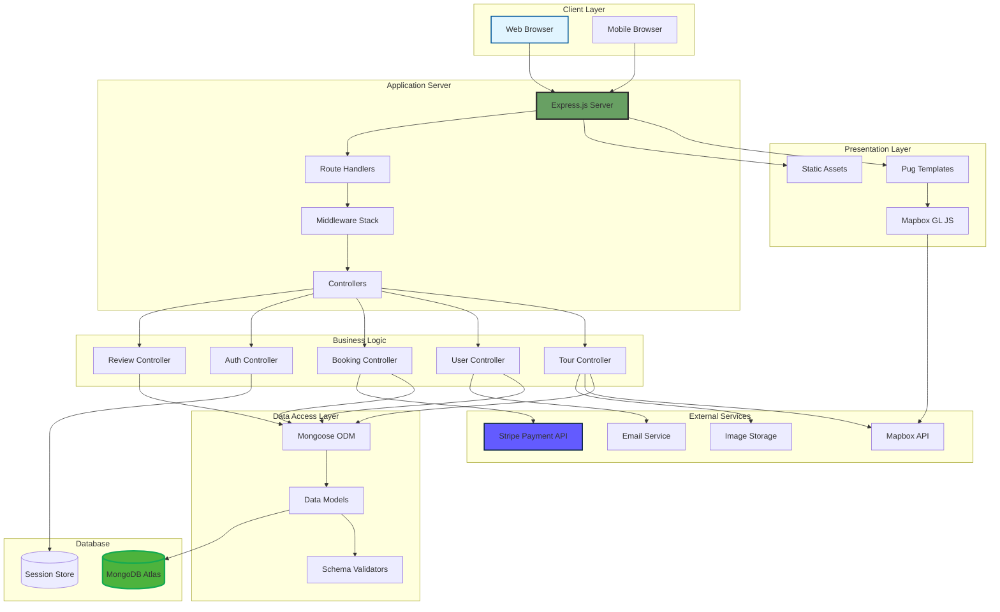
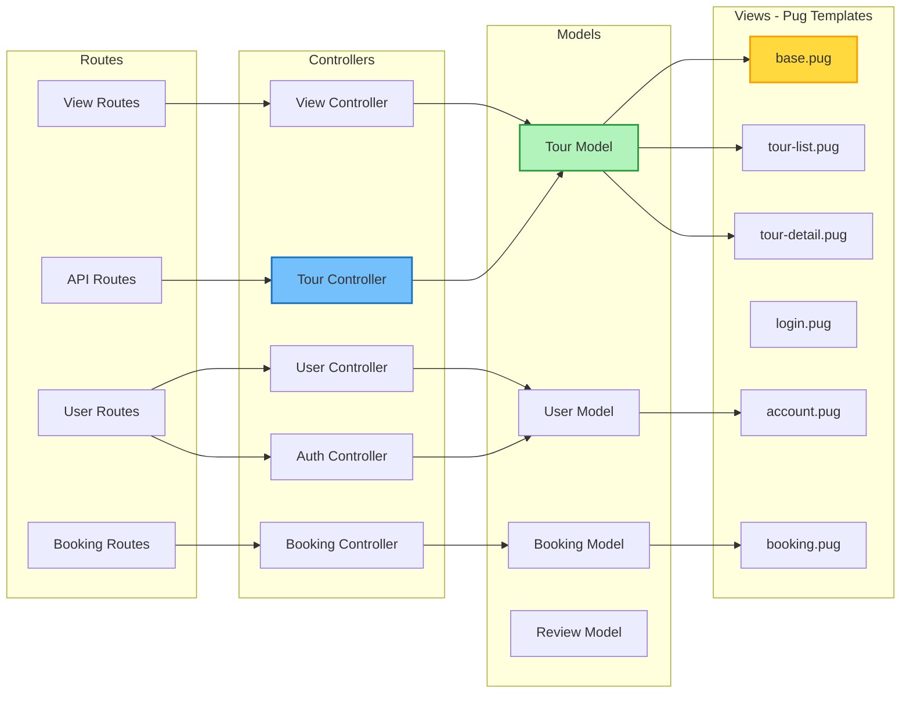
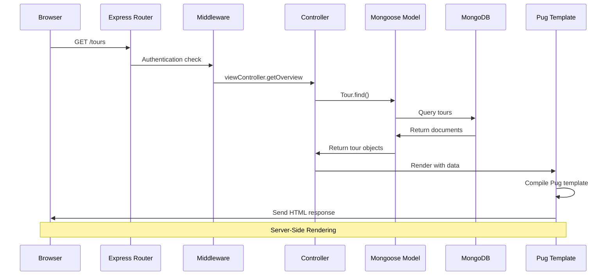
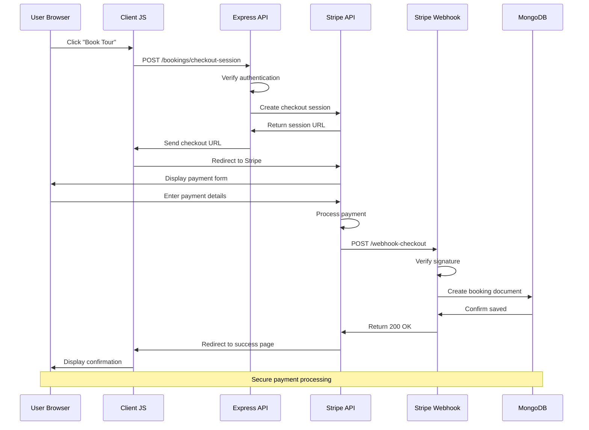
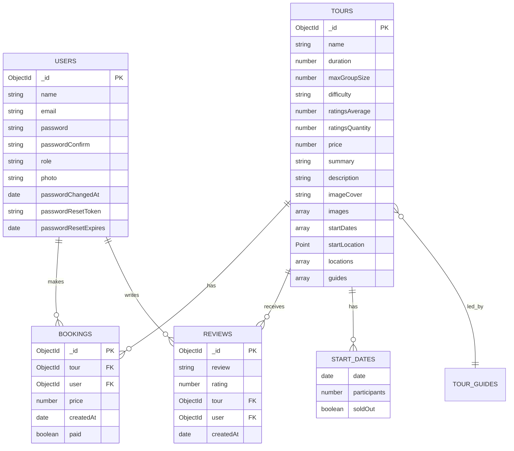
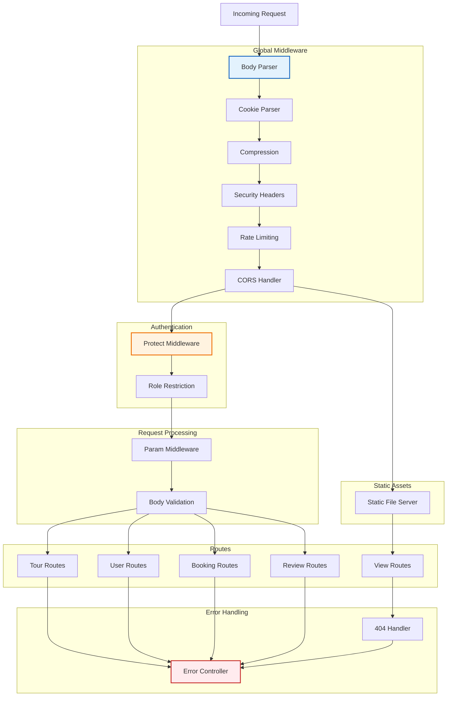
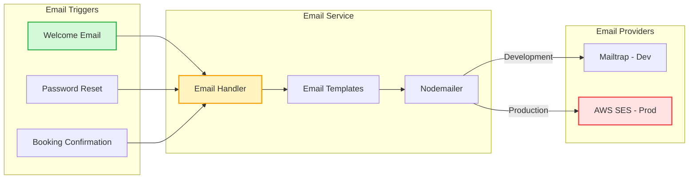
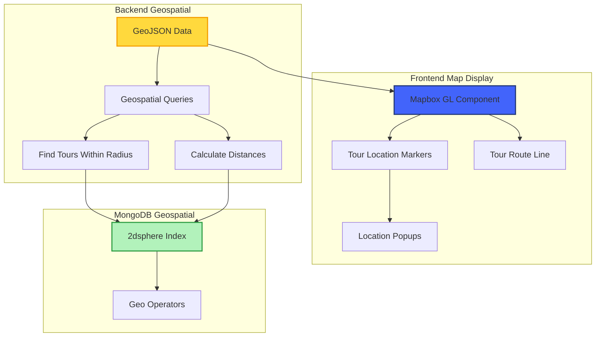

# Natours - System Architecture

## Overview
A full-stack tour booking application built with Node.js, Express, MongoDB, and server-side rendering, featuring user authentication, payment processing with Stripe, interactive maps, and automated email notifications.

## High-Level Architecture

## MVC Architecture Pattern

## Request/Response Flow

## Booking & Payment Flow

## Authentication & Authorization Flow

```mermaid
graph TB
    subgraph "Registration Flow"
        Signup[User Registration]
        HashPassword[Bcrypt Password Hash]
        CreateUser[Create User Document]
        GenerateToken[Generate JWT Token]
    end

    subgraph "Login Flow"
        Login[User Login]
        VerifyPassword[Compare Password Hash]
        IssueToken[Issue JWT Token]
        SetCookie[Set HTTP-Only Cookie]
    end

    subgraph "Protected Routes"
        Request[Incoming Request]
        ExtractToken[Extract JWT from Cookie]
        VerifyToken[Verify Token Signature]
        LoadUser[Load User from DB]
        CheckRole[Check User Role]
    end

    subgraph "Password Reset"
        ForgotPassword[Forgot Password Request]
        ResetToken[Generate Reset Token]
        SendEmail[Send Reset Email]
        ResetPassword[Reset Password with Token]
    end

    Signup --> HashPassword
    HashPassword --> CreateUser
    CreateUser --> GenerateToken

    Login --> VerifyPassword
    VerifyPassword --> IssueToken
    IssueToken --> SetCookie

    Request --> ExtractToken
    ExtractToken --> VerifyToken
    VerifyToken --> LoadUser
    LoadUser --> CheckRole

    ForgotPassword --> ResetToken
    ResetToken --> SendEmail
    SendEmail --> ResetPassword

    style Signup fill:#e3fafc,stroke:#0c8599,stroke-width:2px
    style VerifyToken fill:#fff3bf,stroke:#fab005,stroke-width:2px
    style CheckRole fill:#ffe3e3,stroke:#fa5252,stroke-width:2px
```

## Database Schema

## Middleware Pipeline

## Email Service Architecture

## Geospatial Features

## Technology Stack

### Backend
- **Node.js**: Runtime environment
- **Express.js**: Web application framework
- **Mongoose**: MongoDB ODM
- **JWT**: Authentication tokens
- **Bcrypt**: Password hashing
- **Validator**: Input validation

### Frontend
- **Pug**: Server-side templating
- **Mapbox GL JS**: Interactive maps
- **Axios**: HTTP client
- **Parcel**: Asset bundler

### External Services
- **MongoDB Atlas**: Cloud database
- **Stripe**: Payment processing
- **Mapbox**: Mapping and geocoding
- **AWS SES**: Production emails
- **Mailtrap**: Development emails
- **Cloudinary**: Image hosting

### Security
- **Helmet**: Security headers
- **Express Rate Limit**: DDoS protection
- **Express Mongo Sanitize**: NoSQL injection prevention
- **XSS Clean**: XSS attack prevention
- **HPP**: Parameter pollution prevention

## Key Features

### Tour Management
- Browse available tours
- View detailed tour information
- Interactive tour maps
- Tour reviews and ratings
- Difficulty levels and duration

### User Features
- User registration and login
- Profile management
- Photo uploads
- Password reset functionality
- Booking history

### Booking System
- Secure Stripe checkout
- Payment processing
- Booking confirmations
- Email notifications

### Reviews System
- Write tour reviews
- Rate tours (1-5 stars)
- Average rating calculation
- Review validation (one per user per tour)

## Performance Optimizations

### Database
- Compound indexes for frequent queries
- Geospatial indexes for location queries
- Aggregation pipeline for statistics
- Virtual populate for relationships
- Query middleware for common filters

### Caching
- Static asset caching
- API response caching
- CDN for images
- Browser caching headers

### Rendering
- Server-side rendering with Pug
- Asset minification
- Image optimization
- Lazy loading for images

## Security Measures

- HTTPS-only in production
- JWT stored in HTTP-only cookies
- Password encryption with bcrypt
- Rate limiting on authentication endpoints
- Input sanitization and validation
- NoSQL injection prevention
- XSS attack prevention
- CORS configuration
- Security headers with Helmet
- Content Security Policy
